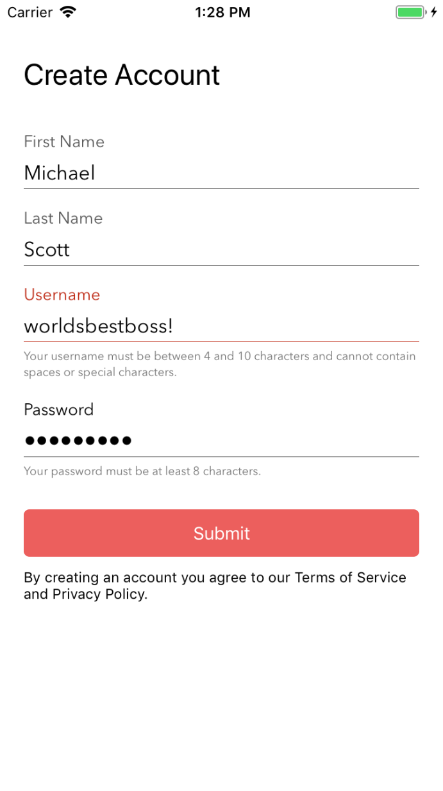
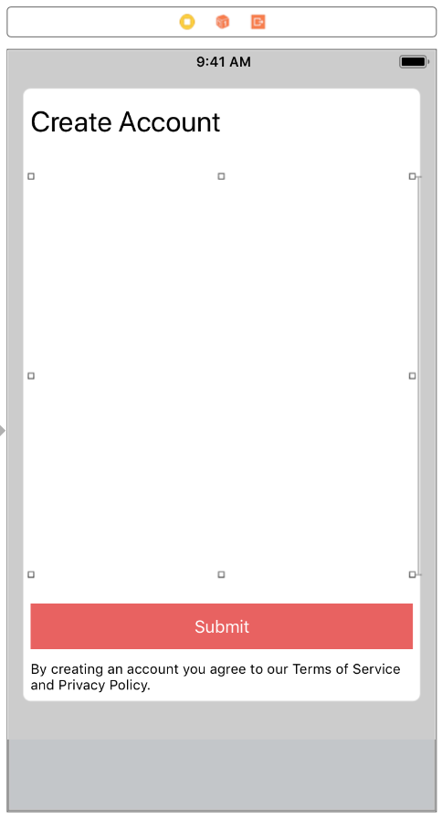
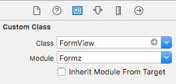

# Formz

[](https://github.com/Carthage/Carthage)
[](LICENSE)


Formz is a super lightweight framework for creating fully customizable forms with validation support that can be easily dropped into any view to work alongside your existing UI. 

[](Documentation/formz.png)


- [Features](#features)
- [Requirements](#requirements)
- [Installation](#installation)
- [Usage](#usage)
- [Demo App](#demo-app)

# Features
- Each form is fully contained within its own view (so it can be added as a subview to any view and works alongside your other UI elements)
- Supports titles (above text field) and helper text (below text field) + all other `UITextField` properties & customizations (like placeholder text, auto-capitalization style, autocorrection style, etc.)
- Fully customizable
    - Set style customizations for the whole form (recommended)
    - Manually customize each form field
- Validation support
- Lightweight

# Requirements
- iOS 10+
- Xcode 9.3+
- Swift 4+

# Installation

## Carthage
Add the following to your Cartfile:

```github "jsahoo/Formz"```

 and run `carthage update`.

 # Usage
1. Drag a `View` from the Object Library anywhere onto your View Controller (you may also want to give it a placeholder height constraint).

[](Documentation/storyboard.png)

2. Within the Identity Inspector, set the view's class to `FormzView` and its module property to `Formz`.

[](Documentation/custom_class.png)

3. Within the source code for your view controller, create `FormTextField`s as needed and add them to your `FormView` in the order in which they should appear.

```swift
let usernameField = FormTextField("username")
usernameField.titleLabel.text = "Username"
usernameField.helperTextLabel.text = "Your username must be between 4 and 10 characters and cannot contain spaces or special characters."
usernameField.helperTextLabel.isHidden = false
usernameField.validationRule = { text in
    guard let text = text, 4 ... 10 ~= text.count else { return false }
    return text.rangeOfCharacter(from: CharacterSet.alphanumerics.inverted) == nil
}
usernameField.textField.autocorrectionType = .no
usernameField.textField.autocapitalizationType = .none
formView.addFormTextField(usernameField)
```

## Validation
Use `FormTextField`'s `validationRule` property to validate the contents of that specific form field. The closure should return `true` if validation succeeds, `false` otherwise.
```swift
firstNameField.validationRule = { text in
    // Valid IFF the String is non-empty and contains only letters
    return text?.isEmpty == false && (text?.rangeOfCharacter(from: CharacterSet.letters.inverted) == nil)
}
```

When you want to validate the whole form (i.e. when user tries to submit), simply call:
```swift
formView.validateAllFields()
```
The function returns `true` if all fields pass validation, `false` otherwise.

## Get Form Field
```swift
formView.formField(withIdentifier: "username")
```

## Get Form Field's Entered Text
```swift
formView.textFromFormField(withIdentifier: "username")
```

## Customization
Cuztomizations can either be applied at the form-level (so that all form fields added to the form have the same styling) or to each individual form field.

### Form-Level Customizations
```swift
formView.titleFont = UIFont(name: "AvenirNext-Regular", size: 14)!
formView.textFieldFont = UIFont(name: "AvenirNext-Regular", size: 17)!
formView.helperFont = UIFont(name: "AvenirNext-Regular", size: 10)!
formView.activeTintColor = .black
formView.inactiveTintColor = .darkGray
formView.validationFailureTintColor = .red
// By default the cursor will use the `activeTintColor`. Set `cursorTintColor` to change it.
// formView.cursorTintColor = .blue
```
### Individual Form Field Customizations
Note that when customizing individual form fields, any property that is not explictly set will default to `FormTextField`'s default value and *not* the parent `FormView`'s customizations.

```swift
let passwordField = FormTextField("password")
passwordField.activeTintColor = .blue
passwordField.inactiveTintColor = .purple
passwordField.validationFailureTintColor = .orange
passwordField.cursorTintColor = .black
passwordField.titleLabel.text = "Password"
passwordField.helperTextLabel.text = "Your password must be at least 8 characters."
passwordField.helperTextLabel.isHidden = false
passwordField.validationRule = { text in
    return (text?.count ?? 0) >= 8
}
passwordField.textField.isSecureTextEntry = true
formView.addFormTextField(passwordField, customAppearance: true)
```

# Demo App
Check out the demo app FormzDemo for more usage examples.